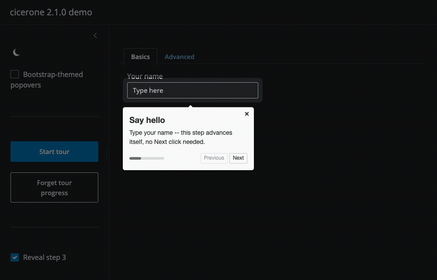
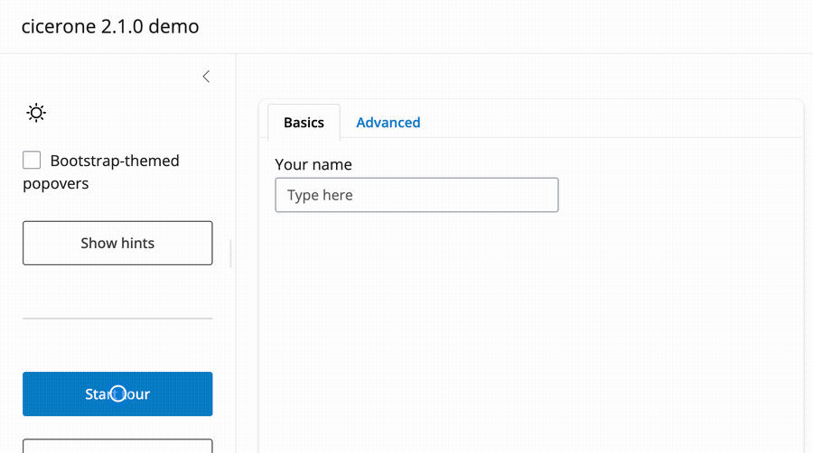
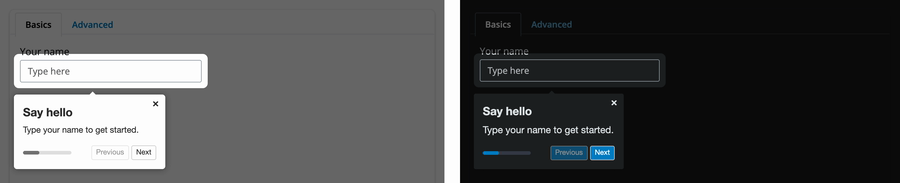
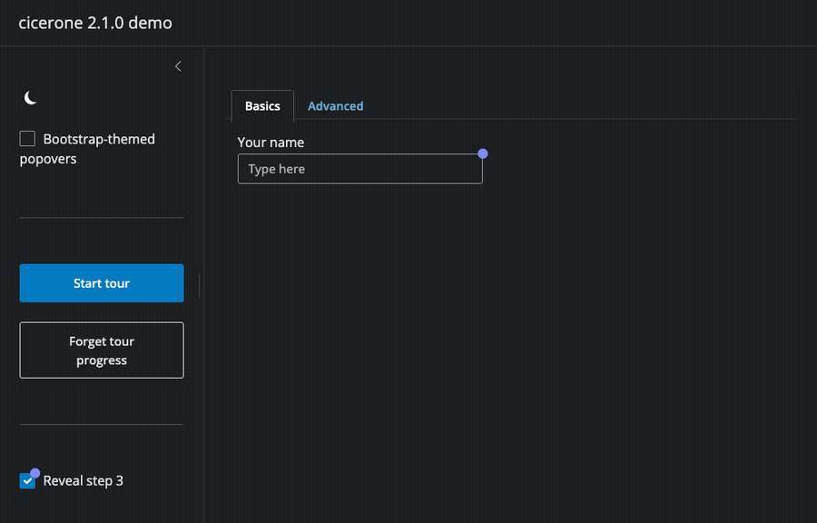

# cicerone

<!-- badges: start -->
[](https://github.com/srsankhe/cicerone/actions/workflows/R-CMD-check.yaml)
[](https://app.codecov.io/gh/srsankhe/cicerone/tree/main)
[](https://github.com/srsankhe/cicerone/blob/main/DESCRIPTION)
[](https://CRAN.R-project.org/package=cicerone)
[](https://lifecycle.r-lib.org/articles/stages.html#stable)
[](https://github.com/srsankhe/cicerone/blob/main/LICENSE.md)
<!-- badges: end -->

cicerone adds guided tours and hints to Shiny applications, powered by [driver.js](https://driverjs.com/) 1.8. It is a fork of [JohnCoene/cicerone](https://github.com/JohnCoene/cicerone) (archived January 2025) that keeps the original API and upgrades the bundled driver.js from 0.9.8 to 1.8.0. Version 2.1.0 adds tour persistence across page reloads, conditional and mutable steps, auto-advancing steps, progress bars and dots, and Bootstrap theming.

A full walkthrough: start the tour, type a name to advance automatically, switch tabs, and finish on an optional step.



## Quick start

```r
library(shiny)
library(bslib)
library(cicerone)

tour <- Cicerone$
  new(
    id = "demo", progress_style = "bar", persist = "cookie",
    overlay_opacity = .6, stage_radius = 8, smooth_scroll = TRUE
  )$
  step(
    el = "name", title = "Say hello",
    description = "Type your name -- this step advances itself, no Next click needed.",
    advance_on = list(el = "#name", event = "input")
  )$
  step(
    el = "tab2_panel", title = "A second tab",
    description = "cicerone switched tabs for you before highlighting this.",
    tab = "Advanced", tab_id = "tabs"
  )$
  step(
    el = "btn_hints", title = "Optional step",
    description = "Only part of the tour while \"Reveal step 3\" is checked.",
    show_if = "(step, opts) => document.querySelector('#show_step3').checked"
  )

ui <- page_fluid(
  use_cicerone(),
  actionButton("start", "Start tour"),
  checkboxInput("show_step3", "Reveal step 3", value = TRUE),
  navset_card_tab(
    id = "tabs",
    nav_panel("Basics", textInput("name", "Your name", placeholder = "Type here")),
    nav_panel("Advanced", tags$div(id = "tab2_panel", "Content on the second tab."))
  ),
  actionButton("btn_hints", "Show hints")
)

server <- function(input, output, session) {
  tour$init()
  observeEvent(input$start, tour$start())
}

shinyApp(ui, server)
```

`use_cicerone()` includes the JavaScript/CSS dependencies. `Cicerone$new()` takes an `id`, `$step()` adds one step per element to highlight, `$init()` registers the tour's Shiny observers, and `$start()` (or `$init(...)$start()` chained) shows it. Full argument list: `?Cicerone`.

## Features

### Lifecycle inputs

Every tour fires `{id}_cicerone_started` once, `{id}_cicerone_ended` with a `reason` whenever it stops, and `{id}_cicerone_event` for every lifecycle event in between.

```r
observeEvent(input$demo_cicerone_ended, {
  reason <- input$demo_cicerone_ended$reason
  message("tour ended: ", reason)
})

# or read the same payload from the R6 object directly
tour$get_ended()
```

`reason` is one of `"done"`, `"close"`, `"programmatic"`, `"superseded"`, `"suppressed"`, or `"dismissed"`; `completed` is `TRUE` exactly when `reason` is `"done"`.

### Wait for the user

A step can advance for reasons other than clicking the highlighted element: `advance_on` reacts to a DOM event on any element, `advance_when` polls a JavaScript predicate until it returns `true`.

```r
tour$step(
  el = "name", title = "Type your name",
  advance_on = list(el = "#name", event = "input")
)

tour$step(
  el = "count", title = "Count to ten",
  advance_when = "(step, opts) => document.querySelector('#count').value >= 10"
)
```

Notice the field advances the tour without a Next click.



### Conditional and mutable tours

`show_if` re-evaluates on every `$start()`, so a step can be shown or skipped based on live app state. `$set_steps()`/`$clear_steps()` replace a live tour's steps after `$init()`; `$set_config()` updates its configuration without rebuilding it.

```r
tour$step(
  el = "extra_panel", title = "Advanced option",
  show_if = "(step, opts) => document.querySelector('#advanced').checked"
)

tour$clear_steps()$step(el = "new_step", title = "Updated step")$set_steps()
tour$set_config(overlay_opacity = 0.9)
```

### One tour at a time

`exclusive` defaults to `TRUE`: starting a tour destroys every other active tour first. `destroy_all()` is a session-wide teardown, independent of `exclusive`.

```r
tour <- Cicerone$new(id = "onboarding", exclusive = TRUE) # the default

# tear down every active tour on the page, regardless of id
destroy_all()
```

### Robust anchors

`wait_for_visible` waits for a step's element to have a non-zero size before moving to it (useful for elements inside a Shiny tab that has not been shown yet). `wait_for_element()` is a standalone version that needs no tour.

```r
tour <- Cicerone$new(wait_for_visible = 2000)$
  step(el = "late_tab_el", title = "Shown once its tab is open")

wait_for_element("#late_div", timeout = 5000, id = "late")
observeEvent(input$late_cicerone_anchor, {
  if (input$late_cicerone_anchor$found) tour$init()$start()
})
```

### Persistence

`persist = "cookie"` remembers a tour's progress across page reloads with no server-side storage; `tour_state()` reads it synchronously, before the `_seen` input arrives.

```r
tour <- Cicerone$new(id = "onboarding", persist = "cookie")$
  step(el = "name", title = "Say hello")

tour$init(run_once = TRUE)
observeEvent(input$btn_start, tour$start(resume = TRUE))
observeEvent(input$btn_forget, tour$forget())

state <- tour_state(session, "onboarding")
```

For server-side storage instead of a cookie, pass a `list(read=, write=, forget=)` adapter, e.g. backed by `session$userData`:

```r
adapter <- list(
  read   = function(id) session$userData$tours[[id]],
  write  = function(id, record) session$userData$tours[[id]] <- record,
  forget = function(id) session$userData$tours[[id]] <- NULL
)
tour <- Cicerone$new(id = "onboarding", persist = adapter)
```

### Progress and theming

`progress_style` swaps the `"2 of 5"` text for a `"bar"` or `"dots"` indicator. `cicerone_theme(preset = "bootstrap")` maps popover colors to the app's own bslib theme, including dark mode.

```r
tour <- Cicerone$new(progress_style = "bar")$
  step(el = "name", title = "Say hello")

ui <- page_fluid(
  use_cicerone(),
  cicerone_theme(preset = "bootstrap")
)
```



### Hints

Pulsing beacons attached to elements; clicking one opens a popover, its
button dismisses it.

```r
hints <- Hints$
  new(id = "demo_hints", button_text = "Got it")$
  hint(el = "name", title = "Beacon 1", description = "A hint on the name field.")$
  hint(
    el = "show_step3", title = "Beacon 2",
    description = "Toggle this to add/remove step 3 of the tour."
  )

hints$init()$show()
```

Hints fire `{id}_cicerone_hint_opened`, `{id}_cicerone_hint_dismissed`, and `{id}_cicerone_hint_button`, and can be driven from the server with `$open()`, `$close()`, `$dismiss()`, and `$restore()`.

Clicking a beacon opens its popover; the button dismisses it.



## Shiny inputs

The bridge sets these Shiny inputs. `{id}` is the `id` of the `Cicerone`/`Hints` object. Every input fires with `priority: "event"` except `{id}_cicerone_state`, a plain input that only changes when the tour's state changes.

| Input | Payload | Fires |
|---|---|---|
| `{id}_cicerone_state` | `{highlighted, previous, before_previous, has_next, has_previous, index, is_first, is_last, total_steps}` | every step highlight |
| `{id}_cicerone_next` | same shape as `_state` | the Next button is clicked, or `$move_forward()` is called |
| `{id}_cicerone_previous` | same shape as `_state` | the Previous button is clicked, or `$move_backward()` is called |
| `{id}_cicerone_started` | `{index, total_steps}` | the first step is highlighted after `$start()`; not re-fired by `$move_to()` |
| `{id}_cicerone_ended` | `{reason, completed, index, total_steps}` | the tour is destroyed, for any reason |
| `{id}_cicerone_event` | `{type, index, element, total_steps, time}` | every lifecycle event, in addition to its specific input above |
| `{id}_cicerone_reset` | `TRUE` | the tour is destroyed (kept for 1.x compatibility; use `_ended` for the reason) |
| `cicerone_reset` (no `{id}` prefix) | `TRUE` | any tour on the page is destroyed |
| `{id}_cicerone_seen` | the persisted record (`{v, status, idx, n, t}`), or `NULL` | `$init()`, when `persist` is set |
| `{id}_cicerone_anchor` | `{selector, found, visible, elapsed}` | a `wait_for_element()` call resolves |
| `{id}_cicerone_hint_opened` | `{id, element}` | a hint's beacon is clicked |
| `{id}_cicerone_hint_dismissed` | `{id, element}` | a hint is dismissed |
| `{id}_cicerone_hint_button` | `{id, element}` | a hint popover's button is clicked |

`reason` in `_ended` is one of `"done"`, `"close"`, `"programmatic"`, `"superseded"`, `"suppressed"`, or `"dismissed"`.

`type` in `_event` is one of `"started"`, `"highlighted"`, `"next"`, `"previous"`, `"done"`, `"close"`, `"ended"`, `"hint_opened"`, `"hint_dismissed"`, `"hint_button"`, `"advance"`, `"start_failed"`, `"anchor_timeout"`, or `"no_visible_steps"`.

Full details, including every payload field: `?cicerone_inputs`.

## Migrating from 2.0.0

- **`exclusive` now defaults to `TRUE`.** Starting a tour destroys every other currently active tour first (their `_ended` fires with `reason = "superseded"`). Set `exclusive = FALSE` to keep the pre-2.1.0 behaviour of overlapping tours.
- **The Done button now works with only `on_next` set on the last step.** driver.js 1.x stops calling `onNextClick` on the last step once `onDoneClick` is defined anywhere; cicerone now always defines `onDoneClick` internally to detect `reason = "done"`, so a last-step `on_next` still fires.
- **`"over"` was removed from the documented `side` values** on `Cicerone$step()`/`highlight()`. It was never functional for a step with a real element; for a centred popover, omit `el` and use `title`/`description` instead. No code change.
- **`mid-center` maps to `align = "center"`** on driver.js's default `side`, since there is no 1.x equivalent for a step with an element.
- **A hint's `on_button_click` no longer replaces dismiss-on-click.** cicerone now calls `dismiss()` after the hook runs, unless the hook returns `false`.

## Installation

Install this fork from GitHub with:

```r
# install.packages("remotes")
remotes::install_github("srsankhe/cicerone")
```

The archived 1.x version remains on [CRAN](https://CRAN.R-project.org/package=cicerone).

## Development

The JavaScript sources live in `srcjs/` and are bundled to `inst/packer/cicerone.js` with webpack:

```sh
NODE_OPTIONS=--openssl-legacy-provider npm run production
```

After changing the R documentation, regenerate the `man/` pages with `devtools::document()`.

End-to-end tests (`tests/testthat/test-e2e-*.R`) drive a real headless Chrome with shinytest2 and are skipped by default; opt in with:

```sh
CICERONE_E2E=true Rscript -e 'devtools::test()'
```

The README's GIFs and stills in `man/figures/` regenerate from the showcase app (`inst/examples/demo/app.R`) with:

```sh
Rscript dev/media/record.R
```

## Credits

cicerone was created by [John Coene](https://github.com/JohnCoene). It wraps [driver.js](https://github.com/nilbuild/driver.js) by Kamran Ahmed.
